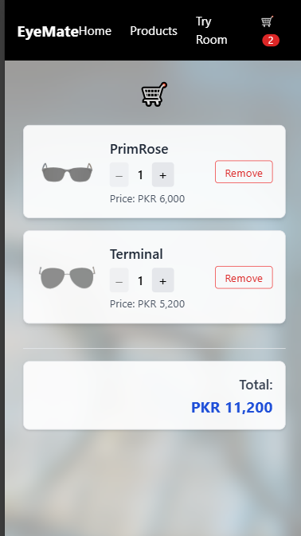

# 🕶️ AI Eyeglasses Try-On Web App

An AI-powered e-commerce prototype that enables users to virtually try on eyeglasses using real-time face detection. Built with React.js, TailwindCSS, MediaPipe Facemesh model and three.js, this app brings a personalized and interactive eyewear shopping experience — right in the browser.

---

## ✨ Features

- Home Page: Clean landing page guiding users to explore the store and try-on feature directly or navigate to the try room of specific eyeglasses from the sliding glasses.
- Product Catalog: Browse and shop the eyeglasses with names, prices, and preview thumbnails.
- AI Try-On Room: Live webcam support with real-time face detection and glasses overlay using Mediapipe facemesh model and three.js.
- Upload Support: Users can try on glasses using a photo from their device.
- Interactive Frame Selection: Switch between multiple eyeglass frames instantly.
- Shopping Cart: Add/remove glasses and view total price.
- Snapshot Feature: Capture and save the try-on image.
- Fully client-side, responsive design — works on both desktop and mobile.

---

## 🔧 Tech Stack

| Tech        | Description                        |
|-------------|------------------------------------|
| React       | Frontend framework (Vite setup)    |
| TailwindCSS | Utility-first CSS for UI styling   |
| MediaPipe   |
     FaceMesh | Face detection and landmarks       |
| Vite        | Fast dev server & build tool       |
| Vercel      | Deployment                         |
| Three.js    | 3D rendering                       |
 
---


##  Getting Started

### 1. Clone the Repository

```bash
git clone https://github.com/DuaeZahra/eyeglasses-tryon.git
cd eyeglasses-tryon
```

### 2. Install Dependencies

```bash
npm install
```

### 3. Run the Development Server

```bash
npm run dev
```
## 📸 Screenshots

<table>
  <tr>
    <td align="center">
      <strong>Home Page</strong><br/>
      
    </td>
    <td align="center">
      <strong>Product Listing</strong><br/>
      
    </td>
    <td align="center">
      <strong>Product Listing</strong><br/>
      
    </td>
  </tr>
  <tr>
  <td align="center">
      <strong>Try-On (Image Upload)</strong><br/>
      
    </td>
    <td align="center">
      <strong>Try-On (Image Upload)</strong><br/>
      
    </td>
    <td align="center">
      <strong>Cart</strong><br/>
      
    </td>
  </tr>
</table>


## 🗒️ Notes

- This is a **frontend-only prototype** — there is no backend or database integration.
- The glasses overlay is approximately aligned for demonstration purposes; it may not be perfectly accurate in all cases.
- All assets, including eyeglass images and face detection models, are served directly from the `public/` folder.

